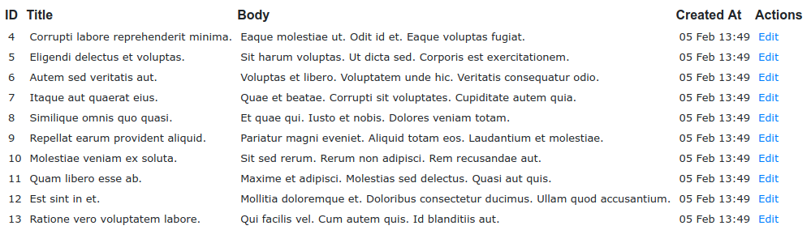
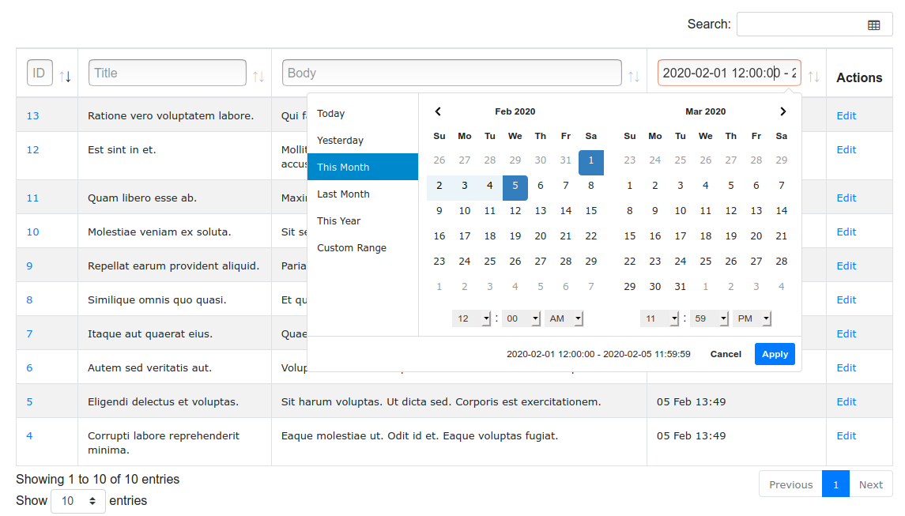

# Trk Datatables

This is a source for [trk_datatables gem](https://rubygems.org/gems/trk_datatables) that is
used with [trk_datatables npm package](https://www.npmjs.com/package/trk_datatables) to render tables.

Instead of using Rails scaffold generator you can use advanced [Datatables plug-in for jQuery library](https://datatables.net).

After [installation](https://github.com/trkin/trk_datatables#installation)
you can use one line command `@datatable.render_html` to generate index page
that supports: global search, filtering and sorting, first page is prerendered
(so non-js crawlers can see it), map and other interesting features.

So instead of basic Rails scaffold



you can get something like



Currenlty it supports:
* ActiveRecord
* Neo4j

## Table of Contents
<!--ts-->
   * [Trk Datatables](#trk-datatables)
      * [Table of Contents](#table-of-contents)
      * [Installation](#installation)
      * [Usage example in Ruby on Rails](#usage-example-in-ruby-on-rails)
      * [Configuration](#configuration)
         * [Global search](#global-search)
         * [Column 'ILIKE' search with text input](#column-ilike-search-with-text-input)
         * [Column 'BETWEEN' search with js daterangepicker](#column-between-search-with-js-daterangepicker)
         * [Column 'IN' search with select tag](#column-in-search-with-select-tag)
         * [Boolean column with checkbox](#boolean-column-with-checkbox)
         * [Action and non database columns](#action-and-non-database-columns)
         * [Values calculated in database](#values-calculated-in-database)
         * [Default order and page length](#default-order-and-page-length)
         * [Params](#params)
         * [Saved Preferences (optional)](#saved-preferences-optional)
         * [Additional data to json response](#additional-data-to-json-response)
      * [Different response for mobile app](#different-response-for-mobile-app)
      * [Test your datatables](#test-your-datatables)
      * [Exceptions](#exceptions)
      * [Debug](#debug)
      * [Alternatives](#alternatives)
      * [Development](#development)
      * [Contributing](#contributing)
      * [License](#license)
      * [Code of Conduct](#code-of-conduct)

<!-- Added by: orlovic, at: Sat Aug 29 05:26:19 CEST 2020 -->

<!--te-->

## Installation

Let's first add Boostrap js package and https://www.npmjs.com/package/trk_datatables
```
yarn add trk_datatables bootstrap jquery popper.js

# app/javascript/packs/application.js
// node_modules
import 'bootstrap'

// our stuff
import 'stylesheet/application'

// attach jQuery so it is available for javascript included with asset pipeline
window.$ = window.jQuery = jQuery;

const trkDatatables = require('trk_datatables')

document.addEventListener('turbolinks:load', () => {
  // this will initialise all data-datatables elements
  trkDatatables.initialise()
})

# app/javascript/stylesheet/application.css
/* here we include other packages so postcss-import plugin will load css file from style attribute from package.json */
@import 'bootstrap'

# config/webpack/environment.js
const { environment } = require('@rails/webpacker')
const webpack = require('webpack');
environment.plugins.append('Provide', new webpack.ProvidePlugin({
  $: 'jquery',
  jQuery: 'jquery',
  Popper: ['popper.js', 'default']
}));

module.exports = environment

# app/views/layouts/application.html.erb
    <%= javascript_pack_tag 'application', 'data-turbolinks-track': 'reload' %>
    <%# we need stylesheet for production server, locally it could work without stylesheet_pack_tag even in production mode %>
    <%= stylesheet_pack_tag 'application', 'data-turbolinks-track': 'reload' %>
    <%# we use jQuery from wepbacker so asset pipeline should be included later %>
    <%= javascript_include_tag 'application', 'data-turbolinks-track': 'reload' %>
```

Than add a gem and sample PostsDatatable

```
# Gemfile
gem 'trk_datatables'

# in console
bundle
rails g trk_datatables post
vi app/datatables/posts_datatable.rb

# config/routes.rb
  resources :posts do
    collection do
      post :search
    end
  end

# app/controllers/posts_controller.rb
  def index
    @datatable = PostsDatatable.new view_context
  end

  def search
    render json: PostsDatatable.new(view_context)
  end

# app/views/posts/index.html.erb
<h1>Posts</h1>
<%= @datatable.render_html search_posts_path(format: :json) %>
```

## Usage example in Ruby on Rails

For a table you need to define `columns` and `rows` (well that is obvious 😌).
In datatable class you also need to define `all_items` method which will  be
used to populate `rows` with paginated, sorted and filtered items (we will call
them `filtered`)

```
# app/datatables/posts_datatable.rb
class PostsDatatable < TrkDatatables::ActiveRecord
  def columns
    {
      'posts.title': {},
      'users.email': {},
    }
  end

  def all_items
    Post.left_joins(:user)
  end

  def rows(filtered)
    filtered.map do |post|
      [
        @view.link_to(post.title, post),
        post.user&.email,
      ]
    end
  end
end
```

In controller you need to initialize with `view_context`

```
# app/controllers/posts_controller.rb
class PostsController < ApplicationController
  def index
    @datatable = PostsDatatable.new view_context
  end

  def search
    render json: PostsDatatable.new(view_context)
  end
end
```

In controller add a route to `:search`

```
# config/routes.rb
Rails.application.routes.draw do
  resources :posts do
    collection do
      post :search
    end
  end
end
```

And finally in a view, use `render_html` to have first page show up prerendered

```
# app/views/posts/index.html
<h1>Posts</h1>
<%= @datatable.render_html search_posts_path(format: :json) %>
```

## Configuration

Datatables will search all columns that you defined as keys in `columns` using a
`ILIKE` (ie `.matches` in Arel ActiveRecord).

In datatables there are two types of search: global (search all columns) and
column search (search is done for specific columns).

### Global search

You can add more columns to global search by overriding `global_search_columns`
method.

```
class PostsDatatable < TrkDatatables::ActiveRecord
  def global_search_columns
    # in addition to columns those fields will be used to match global search
    %w[posts.body users.name]
  end
end
```

### Column 'ILIKE' search with text input

All columns are by default casted to `:string` (you can manually cast with
`column_type_in_db: :string`) and `ILIKE` is perfomed.

If you do not need any specific column configuration,
for example custom `title`, than instead of defining columns as key/value
pairs, you can define them in one line as array of column_key.

```
# app/datatables/posts_datatable.rb
class PostsDatatable < TrkDatatables::ActiveRecord
  def columns
    # instead of
    # {
    #   id: {},
    #   title: {},
    #   body: {},
    # }.each_with_object({}) { |(key, value), obj| obj["posts.#{key}"] = value }
    # you can use one liner
    # %w[posts.id posts.title posts.body]
    # or even shorter using map
    %i[id title body].map { |col| "posts.#{col}" }
  end
end
```

For specific columns you can use following keys

* `title: 'My Title'` set up column header
* `search: false` disable searching for this column
* `order: false` disable ordering for this column
* `select_options: Post.statuses` generate select box instead of text input
* `predefined_ranges: {}` for datetime fiels add ranges to pick up from
* `hide: true` hide column with display none
* `class_name: 'Admin::User'` use different class name than
  `table_name.classify` (in this case of `admin_users` will be `AdminUser`)
* `column_type_in_db` one of the: `:string`, `:integer`, `:date`, `:datetime`,
  `:boolean`

### Column 'BETWEEN' search with js daterangepicker

For column search when search string contains BETWEEN_SEPARATOR (` - `) and
column_type_in_db as one of the: `:date`, `:datetime`, `:integer` and
`:float` than `BETWEEN` is perfomed.

For columns `:date` there will be `data-datatable-range='true'`
attribute so [data range picker](http://www.daterangepicker.com/) will be
automatically loaded. For `:datetime` you can enable time picker in addition to
date.

```
# app/datatables/posts_datatable.rb
class PostsDatatable < TrkDatatables::ActiveRecord
  def columns
    {
      'posts.created_at': { time_picker: true },
    }
  end
end
```

To enable shortcuts for selecting ranges, you can override predefined ranges and
enable for all `date` and `datetime` column

```
# app/datatables/base_trk_datatable.rb
class BaseTrkDatable < TrkDatatables::ActiveRecord
  def predefined_ranges
    # defaults are defined in https://github.com/trkin/trk_datatables/blob/master/lib/trk_datatables/base.rb
    default_predefined_ranges
  end
end
```
or you can enable for all `date` and `datetime columns` for specific datatable
by defining `predefined_ranges` on that datatable. You can disable for specific columns also
```
class PostsDatatable < TrkDatatables::ActiveRecord
  def predefined_ranges
    {
      'Today': Time.zone.now.beginning_of_day..Time.zone.now.end_of_day,
      'Yesterday': [Time.zone.now.beginning_of_day - 1.day, Time.zone.now.end_of_day - 1.day],
      'This Month': Time.zone.today.beginning_of_month...Time.zone.now.end_of_day,
      'Last Month': Time.zone.today.prev_month.beginning_of_month...Time.zone.today.prev_month.end_of_month.end_of_day,
      'This Year': Time.zone.today.beginning_of_year...Time.zone.today.end_of_day,
    }
  end

  def columns
    {
      'posts.created_at': {}, # this column will have predefined_ranges
      'posts.published_on': { predefined_ranges: false }
  end
end
```
or you can define for specific column
```
# app/datatables/posts_datatable.rb
class PostsDatatable < TrkDatatables::ActiveRecord
  def columns
    {
      'posts.created_at': { predefined_ranges: { 'Today': Time.zone.now.beginning_of_day...Time.zone.now.end_of_day } },
    }
  end
end
```

We use
[ActiveSupport::TimeZone](https://api.rubyonrails.org/classes/ActiveSupport/TimeZone.html)
so if you use different than UTC you need to set `Time.zone =` in your app [example values](https://github.com/rails/rails/blob/master/activesupport/lib/active_support/values/time_zone.rb#L31). Whenever Time.parse is used (and we use `Time.zone.parse` for params) it needs correct zone (in Rails you can set timezone in `config.time_zone` or use [browser timezone rails gem](https://github.com/kbaum/browser-timezone-rails)).

### Column 'IN' search with select tag

You can use column_option `select_options: [['name1', 'value1']]` so select box
will be loaded and match if `col IN (value1|value2)`.

```
def columns
  {
    'posts.title': {},
    'posts.status': { select_options: Post.statuses },
  }
end

# in view
link_to 'Active', search_posts_path(PostsDatatable.param_set('posts.status':
Post.statues.values_at(:published, :promoted)))
```

### Boolean column with checkbox

For column_type_in_db `:boolean` it will generate checkbox and use
http://vanderlee.github.io/tristate/ so you can filter for `true`, `false` or
`any` (in this case we ignore this column in filtering)

### Action and non database columns

You can use one column for actions (so it is not related to any db column) just
use empty column_key

```
  def columns
    {
      'posts.title': {},
      '': { title: "<a href='#'>Check all</a>" },
    }
  end

  def rows(filtered)
    filtered.each do |post|
      actions = @view.link_to('View', post)
      [
        post.title,
        actions,
      ]
    end
  end
```

If you have more columns that are not actually columns in database (for example
links or Ruby calculated values) than you can not use empty column_key since
there could be only one (keys in the hash should be unique). When you disable
`order` and `search` than you can use any column name since that column will not
be used in queries. For example column key `posts.body_size` is not in database
nor in Ruby code.

```
  def columns
    {
      'posts.id': {},
      'posts.body_size': { search: false, order: false},
    }
  end

  def rows(filtered)
    filtered.each do |post|
      [
        post.id,
        post.body.size,
      ]
    end
  end
```

### Values calculated in database

There are three types of calculated values (new custom fields that are
generated based on other columns):
* simple calculations like `SELECT *, quantity * price as full_price`
* subqueries like `SELECT *, (SELECT COUNT(*) FROM posts WHERE users.id =
  posts.user_id) AS posts_count`
* aggregate functions in joins/group_by `SELECT users.*, COUNT(posts.id) AS
  posts_count FROM "users" LEFT OUTER JOIN "posts" ON "posts"."user_id" =
  "users"."id" GROUP BY users.id`

Since in SQL you can not use aggregate functions in WHERE (we should repeat
calculation and subqueries), currently TrkDatatables does not support using
aggregate functions since it requires implementation of `HAVING` (unless you
disable search and order for those fields with aggregate functions
`'users.posts_count': { search: false, order: false }`).
You can use concatenation aggregate function: in postgres `STRING_AGG`, in mysql
`GROUP_CONCAT` so in this case we search on real columns. For example let's we
have `Post.select(%(posts.*, GROUP_CONCAT(comments.body) AS
comments_body)).left_outer_joins(:comments) .group('posts.id')` and that we have
a row `postName, comment1, comment2` than when we searh for `comment2` we will
get a row `postName, comment2`.

Simple calculations and subqueries works fine, just you have to use public
method to define calculation (that method is also used in filtering). Name of
method is the same as column name `title_and_body` or `comments_count`. For table
name you should use one of:
`:string_calculated_in_db`, `:integer_calculated_in_db`,
`:date_calculated_in_db`, `:datetime_calculated_in_db` or
`:boolean_calculated_in_db`.

There is an issue in calling `all.count` when you are using subquery, or
selecting two columns `User.select(:id, :email).count`, or using star in string
`User.select('users.*').count` (although `User.select(Arel.star).count` works),
using AS `User.select('users.id AS i').count` (here arel does not help, still
raise exception `User.select(User.arel_table[:email].as('imejl')).count`).
We need to patch ActiveRecord to define `returns_count_sum`:
```
# config/initializers/active_record_group_count.rb
# When you are using subquery or joins/group_by than all.count does not work
# so we need to wrap sql in returns_count_sum
# all.returns_count_sum.count # => 123
# https://stackoverflow.com/a/21031792/287166
# https://github.com/mrbrdo/active_record_group_count/blob/master/lib/active_record_group_count/scope.rb
module ActiveRecordGroupCount
  module Scope
    extend ActiveSupport::Concern

    module ExtensionMethods
      def count(*_args)
        scope = except(:select).select('1')
        scope_sql = if scope.klass.connection.respond_to?(:unprepared_statement)
                      scope.klass.connection.unprepared_statement { scope.to_sql }
                    else
                      scope.to_sql
                    end
        query = "SELECT count(*) AS count_all FROM (#{scope_sql}) x"
        first_result = ActiveRecord::Base.connection.execute(query).first
        if first_result.is_a? Array
          first_result.first
        else
          first_result['count_all']
        end
      end
    end

    module ClassMethods
      def returns_count_sum
        all.extending(ExtensionMethods)
      end
    end
  end
end
# https://github.com/mrbrdo/active_record_group_count/blob/master/lib/active_record_group_count/railtie.rb
ActiveSupport.on_load :active_record do
  include ActiveRecordGroupCount::Scope
end
```

So now we can use `all_items.returns_count_sum.count`. Here is example of simple
calulation and subquery

```
class MostLikedPostsDatatable < TrkDatatables::ActiveRecord
  def columns
    {
      'posts.id': {},
      'string_calculated_in_db.title_and_body': {},
      'integer_calculated_in_db.comments_count': {},
    }
  end

  def all_items
    Post.select(%(
                posts.*,
                #{title_and_body} AS title_and_body,
                (#{comments_count}) AS comments_count
                ))
  end

  # This is used for filtering so you can move this to main query if
  # you have { search: false }
  def title_and_body
    "concat(posts.title, ' ', posts.body)"
  end

  # This is used for filtering so you can move this to main query if
  # you have { search: false }
  def comments_count
    <<~SQL
      (SELECT COUNT(*) FROM comments
      WHERE comments.post_id = posts.id)
    SQL
  end

  def all_items_count
    all_items.returns_count_sum.count
  end

  def filtered_items_count
    filtered_items.returns_count_sum.count
  end

  def rows(filtered)
    # you can use @view.link_to and other helpers
    filtered.map do |post|
      [
        @view.link_to(post.id, post),
        post.title_and_body,
        post.comments_count,
      ]
    end
  end

  def default_order
    [[2, :desc]]
  end
end
```

### Default order and page length

You can override default order (index and direction) and default page length so
if user did not request some order or page length (and if it is not found in
save preferences) and this default values will be used

```
# app/datatables/posts_datatable.rb
class PostsDatatable
  # when we show some invoice_no on first column, and that is reset every year
  # on first april, thatn it is better is to use date column ordering
  def default_order
    [[3, :desc]]
  end

  def default_page_length
    20
  end
end
```

### Params

To set parameters that you can use for links to set column search value, use
this `PostsDatatable.param_set 'users.email', 'my@email.com'`. For between
search you can use range `Time.zone.today..(Time.zone.today + 1.year)` and for
in multiple values use array `[Post.statuses[:draft]]`.

```
<%= link_to 'Active posts for my@email.com', \
      posts_path(
        PostsDatatable.param_set('users.email', 'my@email.com')
          .deep_merge(PostsDatatable.param_set('posts.published_on', Date.parse('2019-10-20')..Date.parse('2019-10-22')))
          .deep_merge(PostsDatatable.param_set('posts.status', Post.statuses.values_at(:published, :promoted))
          .deep_merge(user_id: 1)
      )
%>
```

This will fill proper column search values so you do not need to do it manually
(`post_path(:columns=>{"3"=>{:search=>{:value=>"my@email.com"}},
"2"=>{:search=>{:value=>"1|2"}}}, :user_id=>1)`)

For form fields you can use similar helper `PostsDatatable.form_field_name
'users.email'`
```
<%= form_tag url: posts_path, method: :get do |f| %>
  <%= f.text_field PostsDatatable.form_field_name('users.email'), 'my@email.com' %>
  <%= f.submit 'Search' %>
<% end %>
```

If you need, you can fetch params with this helper

```
PostsDatatable.param_get('users.email', params)
```

You can set filters on datatable even params are blank, for example

```
  def index
    view_context.params.merge! PostsDatatable.param_set 'posts.start_date', Time.zone.today..(Time.zone.today + 1.year)
    @datatable = PostsDatatable.new view_context
  end
```

Inside datatable you can access params using `@view.params`

### Saved Preferences (optional)

You can save column order and page length in User.preferences field so
next time user navigate to same page will see the same order and page length. It
can be `string` or `text`, or some advance `hstore` or `jsonb`.

```
rails g migration add_preferences_to_users preferences:string

# app/models/user.rb
class User
  # no need to serialize if it is hstore or jsonb
  serialize :preferences, Hash
end

# app/datatables/posts_datatable.rb
class PostsDatatable
  def preferences_holder
    @view.current_user
  end

  def preferences_field
    # this is default so do not need to define unless you use different field
    :preferences
  end
end
```

It will store order and page lenght inside `dt_preferences` on
`user.preferences`.

### Additional data to json response

You can override `additional_data_for_json` that will be included in json
response
```
# app/datatables/posts_datatable.rb
class PostsDatatable < TrkDatatables::ActiveRecord
  def additional_data_for_json
    { columns: columns }
  end
end
```

## Different response for mobile app

You can use condition to provide different data, for example let's assume
`@view.api_user?` returns true for json requests from mobile app. Here is
example that provides different columns for normal and api_user:

```
# app/datatables/posts_datatable.rb
class PostsDatatable < TrkDatatables::ActiveRecord
  def columns
    @view.api_user? ? columns_for_api : columns_for_html
  end

  def columns_for_html
    {
      'subscribers.subscriberid': {},
      'subscribers.name': {},
    }
  end

  def columns_for_api
    {
      'subscribers.id': {},
      'subscribers.subscriberid': {},
      'subscribers.name': {},
    }
  end

  def rows(filtered)
    @view.api_user? ? rows_for_api(filtered) : rows_for_html(filtered)
  end

  def rows_for_html(filtered)
    filtered.map do |subscriber|
      [
        @view.link_to(subscriber.subscriberid, subscriber),
        subscriber.name,
      ]
    end
  end

  def rows_for_api(filtered)
    filtered.map do |subscriber|
      [
        subscriber.id,
        subscriber.subscriberid,
        subscriber.name,
      ]
    end
  end

  def additional_data_for_json
    @view.api_user? ? columns_for_api : nil
  end
end
```

## Test your datatables

Here is example how you can test

```
# test/datatables/happ
require 'test_helper'

class PostsDatatableTest < ActiveSupport::TestCase
  def sample_view_params(params = {})
    OpenStruct.new(
      params: params
    )
  end

  test 'find kayaking posts' do
    results = PostsDatatable.new(sample_view_params(activity_names: [activities(:kayaking).name])).all_items

    assert_includes results, posts(:kayak_regata)
    refute_includes results, posts(:half_marathon)
  end
end
```

## Exceptions

To catch errors from TrkDatables you can

```
# app/controllers/application_controller.rb
  rescue_from TrkDatatables::Error do |exception|
    respond_to do |format|
      format.html { redirect_to root_path, alert: exception.message }
      format.json { render json: { error_message: exception.message, error_status: :bad_request }, status: :bad_request }
    end
  end
```

## Debug

You can override some of the methos and put byebug, for example
```
# app/datatables/posts_datatable.rb
class PostsDatatable < TrkDatatables::ActiveRecord
  def as_json(_ = nil)
    byebug
    super
  end
end

```

## Neo4j

User `.as(:users)` so we know which node us used

```
class UsersDatatable < TrkDatatables::Neo4j
  def columns
    {
      'users.email': {},
      'users.created_at': {},
    }
  end

  def all_items
    User
      .as(:users)
      .with_associations(moves: { from_group: [:location], to_groups: [:location] })
  end

  def rows(filtered)
    filtered.map do |user|
      [
        @view.link_to(user.email, @view.admin_user_path(user)),
        user.created_at.to_s(:long),
      ]
    end
  end
end
```

## Alternatives

There are alternatives, for example:
* [jbox-web/ajax-datatables-rails](https://github.com/jbox-web/ajax-datatables-rails)
excellent gem but it's scope is only to produce JSON. I wanted to have server
side rendering and more advance listing

## Development

After checking out the repo, run `bin/setup` to install dependencies. Then, run `rake test` to run all tests.

```
# all
rake
# specific file
ruby -I test test/trk_datatables/base_test.rb
# specific test that matches additional
ruby -I test test/trk_datatables/base_test.rb -n /additional/
```

You can also run `bin/console` for an interactive prompt that will allow you to experiment.

To install this gem onto your local machine, run `bundle exec rake install`. To
release a new version, update the version number and then publish with

```
vi lib/trk_datatables/version.rb
bundle
git commit -am'...'
bundle exec rake release
```

which will create a git tag for the version, push git commits and tags, and deploy the
`.gem` file to [rubygems.org](https://rubygems.org).

Instead of installing you can point directly to your path
```
# Gemfile
# for index, ordering, pagination and searching
# gem 'trk_datatables', '~>0.1'
# no need to `bundle update trk_datatables` when switch to local
gem 'trk_datatables', path: '~/gems/trk_datatables'
```

To generate docs you can run

```
yard server

# clear cache
rm -rf .yardoc/
```

## Contributing

Bug reports and pull requests are welcome on GitHub at https://github.com/trkin/trk_datatables. This project is intended to be a safe, welcoming space for collaboration, and contributors are expected to adhere to the [Contributor Covenant](http://contributor-covenant.org) code of conduct.

## License

The gem is available as open source under the terms of the [MIT License](https://opensource.org/licenses/MIT).

## Code of Conduct

Everyone interacting in the TrkDatatables project’s codebases, issue trackers, chat rooms and mailing lists is expected to follow the [code of conduct](https://github.com/trkin/trk_datatables/blob/master/CODE_OF_CONDUCT.md).
